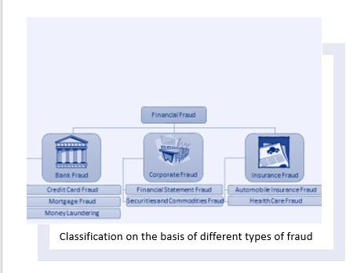
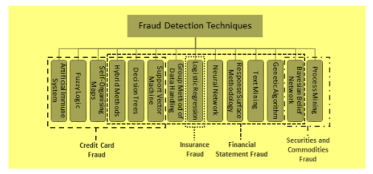
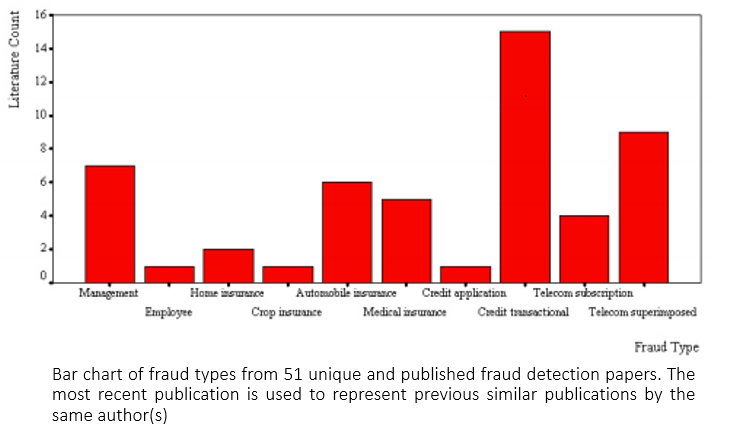

## Predictive financial fraud detection using Neo4j

### Problem
Fraud is human behaviour of intentional deception for gaining advantages of financial or other aspects. Fraud has grown to a serious and threatening financial crime. This crime involves counterfeit or hijack of one or several legitimate attributes of the user, by means of identity theft, physical theft of cards, hacking of online user credentials etc, and using such illegitimate information for own advantages. Fraud can reduce confidence in industry, destabilise economies,
and affect people's cost of living. 	
	
#### First solution/Simplest solution

Traditional approaches of fraud detection relied on manual techniques such as auditing, which are inefficient and unreliable due
to the complexities associated with the problem. Computational intelligence (CI)- based as well as conventional data mining approaches have been proven to be useful because of their ability to detect small anomalies in large data sets.
Data mining is technique of extracting unseen and previously unutilized information from the available data. At present, fraud analysis and detection have received major attention due to its capabilities of extracting hidden information and using it to efficiently classifying or predicting new information. Many methods and algorithms are employed for data mining, from plain statistical analysis to sophisticated artificial intelligence.

Artificial neural network, a computing model analogous to biological neurons of brain, is quite popular for developing intelligent agents for mining data. Artificial neural network is collection of simple processing elements, units or nodes, interconnected for processing using connectionist approach to computation or parallel distribution processing model. Its structure is adaptive; it changes its structure to internal and external flow of information. These networks are mostly used to form links from inputs to outputs or to extract patterns in data.

#### Modern Solution

 Fraudsters are continually refining their methods, such as requirement for detection methods to be able to evolve accordingly.
 Chief Inspector of Business and data mining have already been shown to be useful in similar domains such as credit card approval, bankruptcy prediction, and analysis of share markets. Fraud detection is primarily considered to be a classification problem,
but with a vast imbalance in fraudulent to legitimate transactions misclassification is common and can be significantly costly. Many data mining approaches are efficient classifiers and are applicable to fraud detection for their efficiency at processing large datasets.

- Classification1 : It is based on the different types of fraud prevalent

- Classification2 : It is based on the different types of fraud detection techniques based on different types of fraud

- Classification3 : It is based on the different affected commercial industries

- Classification4 : It is based on the different type of fraudsters

		
### Conclusion

Infrences|Results
---|---
Graph database is better at finding pattern rather than relational database|Very much true as the relational patter at deffrent level as well as in diffrent networks can be very well analysed with graph database

### References
1. APPLICATIONS OF ARTIFICIAL INTELLIGENCE
   TECHNIQUES TO COMBATING CYBER CRIMES: A REVIEW
   Selma Dilek1, Hüseyin Çakır2 and Mustafa Aydın3
2. A Comprehensive Survey of Data Mining-based Fraud Detection Research
   CLIFTON PHUA1*, VINCENT LEE1, KATE SMITH1 & ROSS GAYLER2
3. Intelligent Financial Fraud Detection Practices: An Investigation
   Jarrod West1, Maumita Bhattacharya and Rafiqul Islam
